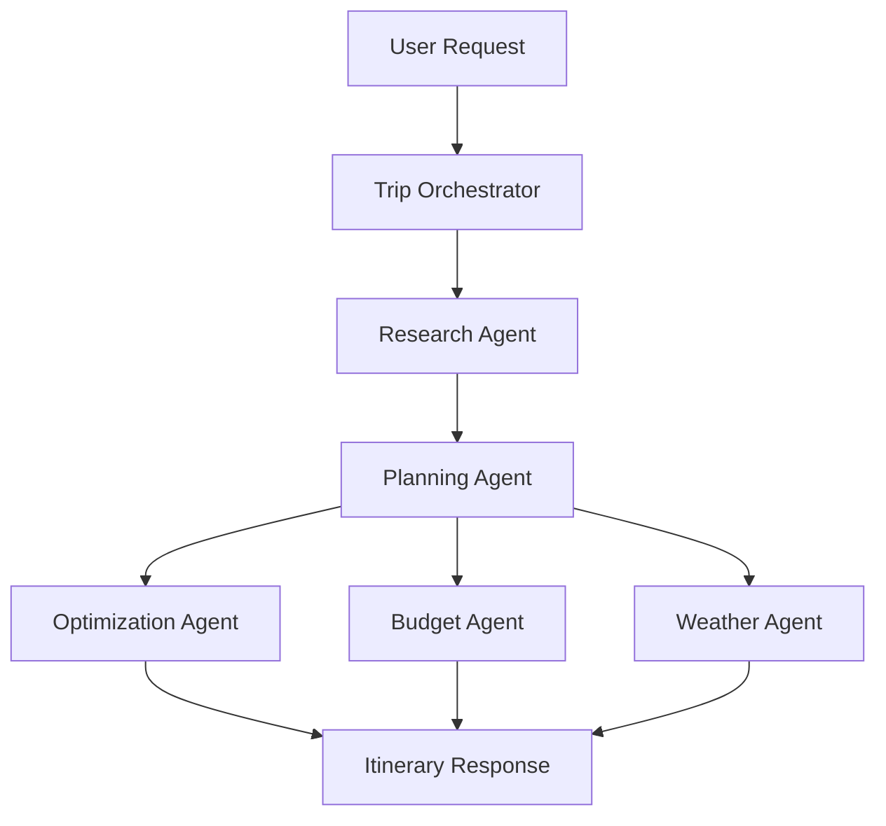
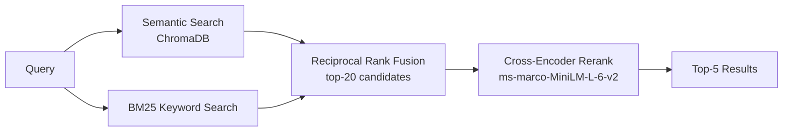

# TripOptimizer — AI-Powered Budget-Aware Travel Planner

A multi-agent system that builds personalized, budget-optimized travel itineraries using retrieval-augmented generation, live attraction data, and multi-agent orchestration.

[](https://www.python.org/)
[](https://fastapi.tiangolo.com/)
[](https://react.dev/)
[](LICENSE)

## Overview

TripOptimizer builds itineraries based on budget, interests, and travel dates, adjusting the number of attractions per day to both the user's budget and the destination's cost of living — rather than returning the same fixed itinerary regardless of what a trip actually costs to run.

### Key Features

- **Budget-aware planning**: adjusts attractions (1–5/day) to the user's budget
- **City cost intelligence**: cost-of-living multipliers for 90+ cities
- **Multi-currency support**: 49 currencies with conversion
- **Seasonal weather**: season-specific packing guidance for the travel dates
- **Route optimization**: TSP-based estimate of travel time between attractions
- **Smart scheduling**: attractions placed by time of day (morning gardens, evening viewpoints)
- **Budget validation**: rejects trips below the destination's minimum viable budget

## System Architecture

### Multi-Agent Orchestration

Five agents coordinated by an orchestrator; Research runs first (feeding Planning), then Optimization/Budget/Weather run against the resulting itinerary:



### Retrieval Pipeline (Research Agent)

Attraction discovery combines live Google Places results with a two-stage retrieval pipeline over the local knowledge base — a standard retrieve-broad, rerank-precise pattern:



Measured impact of each stage is in [Evaluation Results](#evaluation-results).

### Agent Responsibilities

#### 1. Research Agent
- **Purpose**: discovers attractions via the retrieval pipeline above plus live Google Places data
- **Capabilities**:
  - Hybrid retrieval + reranking over the local knowledge base for local tips and attraction context (see [Evaluation Results](#evaluation-results) for before/after numbers)
  - Fetches top-rated attractions from Google Places
  - Combines retrieval results with live API data, selecting `trip_duration × 5` attractions for variety
- **Output**: curated attraction list with ratings, coordinates, prices

#### 2. Planning Agent
- **Purpose**: creates day-by-day itineraries under budget constraints
- **Capabilities**:
  - Calculates optimal attractions per day from budget and city cost multiplier (e.g. Bangkok ×0.4, Paris ×1.5)
  - Categorizes attractions by best time of day (morning/evening/night)
  - Builds a 7-slot daily schedule (9 AM–11 PM) with city-adjusted cost estimates
- **Budget tiers**: Ultra Budget (1/day) → Budget (2) → Standard (3) → Comfortable (4) → Luxury (5 + premium experiences)
- **Output**: complete itinerary with activities, times, costs

#### 3. Optimization Agent
- **Purpose**: analyzes itinerary travel efficiency
- **Capabilities**: computes total travel distance (Haversine) and estimated time saved versus an unoptimized order
- **Note**: does not reorder attractions — preserves the time-of-day scheduling from the Planning Agent
- **Output**: optimization statistics

#### 4. Budget Agent
- **Purpose**: compares trip cost against user budget
- **Capabilities**: currency conversion, over/under/on-budget status, dual-currency display
- **Output**: budget analysis with status

#### 5. Weather Agent
- **Purpose**: seasonal forecast for the travel dates
- **Capabilities**: seasonal temperature/condition patterns and packing guidance for major cities (expandable)
- **Output**: seasonal forecast with packing recommendations

## Tech Stack

### Backend
- **Framework**: FastAPI 0.104
- **AI/ML**: 
  - Groq API (Llama 3.3 70B) for agent intelligence
  - ChromaDB for vector database & RAG
  - Hybrid retrieval: BM25 (`rank_bm25`) + semantic search, fused with
    Reciprocal Rank Fusion, reranked with a cross-encoder
    (`cross-encoder/ms-marco-MiniLM-L-6-v2` via `sentence-transformers`)
- **APIs**:
  - Google Places API (attraction discovery)
  - Google Maps API (route visualization)
- **Language**: Python 3.11+ (developed on 3.12; Docker image pins 3.11 for platform compatibility)
- **Key Libraries**:
  - `chromadb` - Vector database
  - `rank_bm25` - Keyword retrieval
  - `groq` - LLM API client
  - `pydantic` - Data validation
  - `httpx` - Async HTTP client

### Frontend
- **Framework**: React 18.3 + Vite
- **Styling**: Tailwind CSS 3.4
- **UI Components**: 
  - Lucide React (icons)
  - Recharts (budget visualization)
  - @react-google-maps/api (maps)
- **Routing**: React Router DOM 6.22

### Infrastructure
- **Vector DB**: ChromaDB (local persistent storage)
- **Algorithms**: TSP optimization, Haversine distance
- **Deployment**: Netlify (frontend) + Render (backend)

## Getting Started

### Prerequisites
```bash
# Required
- Python 3.11+
- Node.js 18+
- npm or yarn

# API Keys Needed
- Groq API Key (free tier available)
- Google Places API Key
- Google Maps API Key
```

### Installation

#### 1. Clone Repository
```bash
git clone https://github.com/ysowmya2000/trip-optimizer.git
cd trip-optimizer
```

#### 2. Backend Setup
```bash
cd backend

# Create virtual environment
python -m venv venv
source venv/bin/activate  # On Windows: venv\Scripts\activate

# Install dependencies
pip install -r requirements.txt

# Create .env file
cat > .env << EOF
GROQ_API_KEY=your_groq_api_key_here
GOOGLE_PLACES_API_KEY=your_google_places_key_here
EOF

# Initialize ChromaDB (first time only)
python -c "from app.db.vector_store import travel_kb; print('✅ ChromaDB initialized')"
```

#### 3. Frontend Setup
```bash
cd ../frontend

# Install dependencies
npm install

# Create .env file (VITE_API_BASE_URL falls back to localhost:8000 if unset)
cat > .env << EOF
VITE_GOOGLE_MAPS_API_KEY=your_google_maps_key_here
EOF
```

### Running the Application

#### Terminal 1 - Backend
```bash
cd backend
source venv/bin/activate
python -m uvicorn app.main:app --reload --host 0.0.0.0 --port 8000
```

#### Terminal 2 - Frontend
```bash
cd frontend
npm run dev
```

**Access**: http://localhost:5173

## How It Works

### Example: Bangkok 5 Days with ₹50,000 INR

1. **User Input**:
   - Destination: Bangkok
   - Duration: 5 days
   - Budget: ₹50,000 INR
   - Currency: Indian Rupee
   - Interests: Culture, Food, Nature
   - Start Date: March 20, 2026

2. **Backend Processing**:

   **Step 1: Budget Validation**
   - Converts ₹50,000 → $601 USD
   - Checks minimum: Bangkok needs ~$160 for 5 days
   - ✅ Budget sufficient

   **Step 2: City Cost Analysis**
   - Bangkok multiplier: ×0.4 (very affordable)
   - Daily budget: $601 ÷ 5 = $120/day
   - With ×0.4 multiplier: effectively $300/day purchasing power
   - **Tier**: Comfortable (4 attractions/day)

   **Step 3: Research (RAG + Google Places)**
   - Queries ChromaDB: "temples, street food, parks in Bangkok"
   - Fetches Google Places: Top-rated attractions
   - Combines: 25 attractions total
   - Examples: Wat Pho, Grand Palace, Chatuchak Market, etc.

   **Step 4: Planning**
   - Creates 5 days × 4 attractions = 20 activities
   - Categorizes by time:
     - Morning: Wat Pho (temple, cooler hours)
     - Afternoon: Grand Palace, Jim Thompson House
     - Evening: Asiatique (riverside, sunset)
     - Night: Khao San Road (nightlife)
   - Estimates costs:
     - Meals: $35/day (× 0.4 = $14/day actual)
     - Attractions: 4 × $30 = $120 (× 0.4 = $48 actual)
     - Transport: $10 (× 0.4 = $4 actual)
     - **Daily**: ~$66 USD = ₹5,488 INR
     - **Total**: ~$330 USD = ₹27,436 INR

   **Step 5: Optimization**
   - Calculates distances between attractions
   - Estimates 300 min time saved vs random order

   **Step 6: Budget Analysis**
   - Trip cost: ₹27,436 INR
   - Your budget: ₹50,000 INR
   - **Status**: ✅ Under budget by ₹22,564

   **Step 7: Weather**
   - March in Bangkok: Hot Season
   - Temperature: 28-35°C
   - Advice: Pack light, breathable clothes. Stay hydrated.

3. **Frontend Display**:
```
   Budget: ₹50,000 INR
   Trip Cost: ₹27,436 INR (≈ ฿11,820 THB)
   ✅ Under Budget

   Day 1: 4 attractions (₹5,487 INR)
   - 9:00 AM: Wat Pho
   - 12:00 PM: Lunch
   - 1:30 PM: Grand Palace
   - 4:00 PM: Jim Thompson House
   - 7:00 PM: Dinner
   - 8:30 PM: Asiatique

   Weather: Hot Season • 28-35°C
   Pack: Light clothes, sunscreen
```

### Budget Comparison: Same Budget, Different Cities

| City | Budget | Multiplier | Tier | Attractions/Day | Total Cost |
|------|--------|------------|------|----------------|------------|
| Bangkok | ₹50,000 | ×0.4 | Comfortable | 4 | ₹27,436 ✅ |
| Prague | ₹50,000 | ×0.8 | Standard | 3 | ₹45,200 ✅ |
| Paris | ₹50,000 | ×1.5 | Budget | 2 | ₹48,900 ✅ |
| London | ₹50,000 | ×1.6 | Budget | 1-2 | ₹51,200 ⚠️ |

## City Cost Database

### Expensive Cities (×1.4 - ×1.8)
- Paris (×1.5), London (×1.6), Tokyo (×1.7)
- Zurich (×1.8), Geneva (×1.7), Dubai (×1.8)
- Singapore (×1.4), Hong Kong (×1.5), Sydney (×1.5)

### Moderate Cities (×0.8 - ×1.2)
- Barcelona (×1.1), Madrid (×1.0), Rome (×1.1)
- Prague (×0.8), Budapest (×0.7), Lisbon (×0.9)
- Seoul (×1.0), Taipei (×0.9), Shanghai (×1.0)

### Budget-Friendly Cities (×0.3 - ×0.7)
- Bangkok (×0.4), Bali (×0.3), Hanoi (×0.4)
- Mumbai (×0.4), Delhi (×0.4), Manila (×0.5)
- Mexico City (×0.5), Lima (×0.5), Cairo (×0.4)

**Total**: 90+ cities with cost data

## Supported Currencies

49 currencies including:
- 🇺🇸 USD, 🇪🇺 EUR, 🇬🇧 GBP, 🇯🇵 JPY, 🇮🇳 INR
- 🇦🇺 AUD, 🇨🇦 CAD, 🇨🇭 CHF, 🇨🇳 CNY, 🇸🇬 SGD
- 🇹🇭 THB, 🇻🇳 VND, 🇮🇩 IDR, 🇲🇾 MYR, 🇵🇭 PHP
- And 34 more...

## Features Showcase

### 1. Budget Validation
```
User enters ₹10,000 for 5-day Bangkok trip
❌ "Budget too low! Minimum needed: ₹21,000 INR"
```

### 2. Dual Currency Display
```
Your Budget: ₹50,000 INR
Trip Cost: ₹27,436 INR (≈ ฿11,820 THB)
Day 1: ₹5,487 INR (≈ ฿2,364 THB)
```

### 3. Seasonal Weather
```
Season: Hot Season (March)
Temperature: 28-35°C
Condition: Hot & Humid
What to Pack: Light, breathable clothes. Stay hydrated.
```

### 4. Smart Time Scheduling
```
9:00 AM  - Temple (cooler morning hours)
12:00 PM - Lunch
4:00 PM  - Museum (afternoon)
7:00 PM  - Dinner
8:30 PM  - Rooftop bar (sunset/evening)
10:00 PM - Night market (nightlife)
```

## Project Structure
```
trip-optimizer/
├── backend/
│   ├── app/
│   │   ├── agents/
│   │   │   ├── research_agent.py      # Retrieval + Google Places
│   │   │   ├── planning_agent.py      # Budget-aware scheduling
│   │   │   ├── optimization_agent.py  # Route optimization
│   │   │   ├── budget_agent.py        # Cost analysis
│   │   │   ├── weather_agent.py       # Seasonal forecasts
│   │   │   └── orchestrator.py        # Agent coordination
│   │   ├── retrieval/
│   │   │   ├── bm25_retriever.py      # Keyword search
│   │   │   ├── hybrid_retriever.py    # RRF fusion
│   │   │   └── reranker.py            # Cross-encoder reranking
│   │   ├── api/
│   │   │   └── trips.py               # FastAPI endpoints
│   │   ├── db/
│   │   │   ├── vector_store.py        # ChromaDB setup
│   │   │   └── seed_attractions.py    # Corpus seeding
│   │   ├── schemas/
│   │   │   └── trip.py                # Pydantic models
│   │   ├── utils/
│   │   │   ├── budget_calculator.py   # Budget tier logic
│   │   │   ├── city_costs.py          # City multipliers
│   │   │   └── currency_converter.py  # Currency conversion
│   │   └── main.py                    # FastAPI app
│   ├── eval/                          # Eval harness (see Evaluation Results)
│   ├── data/
│   │   └── chroma/                    # ChromaDB storage
│   ├── Dockerfile
│   └── requirements.txt
├── frontend/
│   ├── src/
│   │   ├── pages/
│   │   │   ├── Home.jsx               # Trip input form
│   │   │   └── Results.jsx            # Itinerary display
│   │   ├── components/
│   │   │   ├── TripMap.jsx            # Google Maps
│   │   │   ├── BudgetChart.jsx        # Cost visualization
│   │   │   ├── DestinationHero.jsx    # Hero section
│   │   │   └── ProTips.jsx            # Travel tips
│   │   └── App.jsx
│   ├── package.json
│   └── tailwind.config.js
├── render.yaml                        # Backend deploy config (Render)
├── DEPLOYMENT.md
└── README.md
```

## API Endpoints

### POST `/api/trips/create`

**Request**:
```json
{
  "destination": "Bangkok",
  "trip_duration": 5,
  "budget": 50000,
  "currency": "INR",
  "interests": ["culture", "food", "nature"],
  "start_date": "2026-03-20"
}
```

**Response**:
```json
{
  "success": true,
  "itinerary": {
    "destination": "Bangkok",
    "trip_duration": 5,
    "days": [...],
    "estimated_total_cost": 27436.50
  },
  "budget_analysis": {
    "user_budget": 50000,
    "estimated_cost_user": 27436.50,
    "status": "under_budget"
  },
  "weather_forecast": {
    "season": "Hot Season",
    "temperature": "28-35°C"
  },
  "currency_info": {
    "user_currency": "INR",
    "destination_currency": "THB"
  }
}
```

## Testing

Automated eval harness: `backend/eval/` (see
[Evaluation Results](#evaluation-results) above). Run with
`python -m eval.run_budget_eval`, `run_quality_eval`, or `run_retrieval_eval
--mode {semantic,hybrid,reranked}` from `backend/`.

### Manual Testing Scenarios

1. **Budget Rejection**:
   - Bangkok, 5 days, ₹10,000 → Should reject with minimum amount

2. **Budget Tiers**:
   - Bangkok, 5 days, ₹25,000 → 2 attractions/day
   - Bangkok, 5 days, ₹50,000 → 4 attractions/day
   - Bangkok, 5 days, ₹2,00,000 → 5 attractions/day

3. **City Costs**:
   - Same budget (₹50,000) should give:
     - Bangkok: 4 attractions/day (cheap)
     - Prague: 3 attractions/day (moderate)
     - Paris: 1-2 attractions/day (expensive)

4. **Seasonal Weather**:
   - Bangkok March → Hot Season
   - Paris March → Spring
   - London December → Winter

## Evaluation Results

Quantitative eval harness in `backend/eval/`, run against the real agent
pipeline rather than a mocked simplification. Full per-case JSON reports are
in `backend/eval/results/`.

### Budget & Tier Accuracy

44 synthetic test cases across the three city-cost tiers and budget levels,
including boundary cases at tier cutoffs, scored against `budget_calculator`'s
actual logic (not hand-guessed expected values).

| Metric | Score |
|---|---|
| Tier assignment accuracy | 100% |
| Attractions-per-day accuracy | 100% |
| Budget status accuracy | 0% |
| Cost estimate mean deviation | 25.7% (n=11 hand-verified subset) |

The 0% isn't a harness bug — it's a real finding. `planning_agent`'s actual
cost formula runs 25–40% cheaper than the tier-selection formula in
`budget_calculator` predicts, so the two were never reconciled with each
other and the pipeline reports "under budget" more often than the tier math
alone would suggest.

### Itinerary Quality

Three rule-based dimensions scored per generated itinerary (44 cases):

| Dimension | Score |
|---|---|
| Time-slot appropriateness | 97.4/100 |
| Attraction diversity | 57.7/100 |
| Interest-match rate | 100/100 |

Interest-match sitting flat at 100 reflects a methodology limit: the
interest-to-category keyword map is broad enough that most attractions
trivially match, so it currently has weak discriminative power.

### RAG Retrieval: Semantic → Hybrid → Reranked

20 manually labeled queries, with ground truth from real ChromaDB corpus
documents tagged by destination and category (not LLM-generated labels).
Precision@5 at each stage:

| Stage | Precision@5 |
|---|---|
| Semantic search only (baseline) | 0.89 |
| + BM25 hybrid (RRF fusion, no rerank) | 0.89 |
| + Cross-encoder reranking | 1.00 |

Hybrid fusion alone didn't move the needle — RRF just re-orders two
already-decent rankings without adding new judgment. The cross-encoder is
what closed the gap: scoring each (query, candidate) pair directly fixed
cases like "temples in Bangkok," where the semantic-only baseline mixed in a
Hanoi temple and an unrelated nightlife venue. Ground truth here is coarse
(destination+category match, not a strict ranking), so the perfect reranked
score reflects a well-separated corpus at that granularity, not that
per-category ranking is fully solved.

The live deployment runs with reranking disabled for memory reasons (see
[Deployment](#deployment)), so it reflects the 0.89 hybrid figure, not 1.00.

## Deployment

**Status**: runs fully locally; not currently kept live as a public demo.

Deployment artifacts (`backend/Dockerfile`, `render.yaml`, `frontend/netlify.toml`)
were built and validated against real infrastructure — both services were
actually deployed to Render and Netlify, and a real end-to-end trip
submission was tested through the live frontend into the live backend. Two
issues surfaced there: an OOM crash from the reranker's PyTorch dependency
(fixed — reranking is disabled in the deployed build via `ENABLE_RERANKING`),
and a request timeout from Render's free-tier proxy hitting
`research_agent.py`'s sequential (non-parallel) Google Places API calls
(not fixed — parallelizing those calls would change Research Agent
orchestration flow, out of scope for this work). Given that, the app is
kept as a local-first project rather than a flaky public link.

Full investigation, exact env vars, and redeploy steps are in
[`DEPLOYMENT.md`](./DEPLOYMENT.md).

## Future Enhancements

- [ ] Flight booking integration
- [ ] Hotel recommendations
- [ ] Multi-city trips
- [ ] Collaborative planning (share with friends)
- [ ] Real-time pricing updates
- [ ] Premium experiences for high budgets
- [ ] Visa requirement checker
- [ ] Travel insurance recommendations
- [ ] Local SIM card suggestions
- [ ] Restaurant reservations

## License

This project is licensed under the MIT License.

## Author

**Sowmya Yerraguntla**

- LinkedIn: [Sowmya Yerraguntla](https://www.linkedin.com/in/sowmyayerraguntla/)

## Project Stats

- **Lines of code**: ~4,700 (backend ~2,800, eval harness ~1,200, frontend ~700)
- **Agents**: 5, plus a two-stage retrieval pipeline (BM25 + semantic, cross-encoder reranked)
- **Cities supported**: 90+
- **Currencies**: 49
- **Eval coverage**: 44 budget/tier cases, 44 quality-scored itineraries, 20 labeled retrieval queries
- **External APIs**: Groq, Google Places, Google Maps
